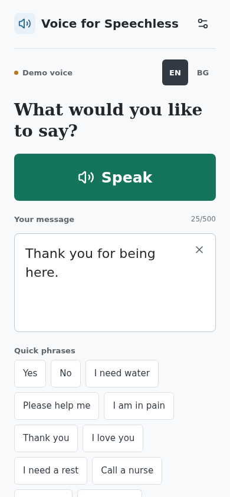
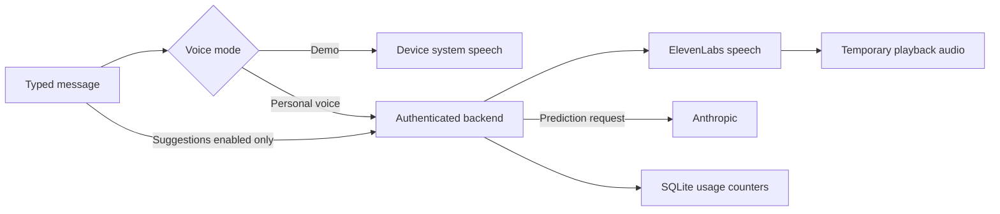

# Voice for Speechless

Type a message. Hear it spoken. Connect your own voice when you're ready.

Originally built to help someone communicate during recovery from surgery. This version includes an account-free demo and a backend for connecting a consenting personal voice.



*Actual browser capture, using a synthetic message. Native iPhone verification remains separate.*

[Watch the browser interaction clip](docs/images/interaction.webm) or [see the Bulgarian interface](docs/images/phone-bulgarian.png). The clip shows typing and settings, without personal audio.

## Try It

Use Node.js 24 or newer and npm. No keys, recordings, or paid account are needed for demo mode.

```bash
npm ci
npm run web
```

Open the local URL printed by Expo. The demo uses an installed system voice, not a clone. If your browser has no voice for the selected language, use a supported device with that voice installed. On iOS, system speech requires silent mode to be off. [Expo Speech documentation](https://docs.expo.dev/versions/v54.0.0/sdk/speech/)

For a phone, run `npm start` and use an Expo Go version compatible with SDK 54, or create a development build. See [development setup](docs/DEV_QUICKSTART.md).

## Built Around Communication

- A large Speak button above the input, plus Stop and clear-and-refocus controls.
- One-tap phrases for common requests, available while typing.
- English and Bulgarian interface strings and editable phrase lists.
- An optional personal voice, accessed through your own authenticated backend.
- Optional next-word suggestions, off by default. Enabling them sends typed text to the backend and Anthropic.
- Provider keys held only on the server; revocable device credentials and persistent request/character allowances.

## Connect Your Voice

The personal-voice mode is a single-owner template: each backend serves one voice configured by its owner. It does not include public voice enrollment or a recording upload service.

Follow [voice and privacy setup](docs/PRIVACY_AND_VOICE_SETUP.md) to create a clone with the speaker's permission, configure `server/.env.local`, and provision a separate credential for each installation. The app's Voice settings accepts the backend URL and installation credential; those values are not compiled into a shared build.



## Development

React Native + Expo SDK 54, TypeScript, Expo Speech/Audio/SecureStore, and a Fastify backend on Node.js 24. SQLite stores usage counters without retaining message text or generated speech. ElevenLabs supplies connected TTS; Anthropic supplies optional word suggestions.

```bash
npm run typecheck
npm test
npm --prefix server ci
npm --prefix server test
```

- [Quickstart and troubleshooting](docs/DEV_QUICKSTART.md)
- [Architecture and design choices](docs/ARCHITECTURE.md)
- [Own iOS/Android build and distribution](docs/Build_doc.md)
- [Verification results and remaining checks](docs/PUBLIC_RELEASE_REPORT.md)
- [Contributing](CONTRIBUTING.md)

## Limits

Connected mode needs internet, private provider access, and a configured backend. Voices and languages available in demo mode depend on the device. System speech may use a device vendor's online speech service; this application makes no provider API calls in demo mode. The app is a communication aid and does not provide medical advice or emergency dispatch.

The backend targets one server instance with a persistent local disk. Daily usage allowances bound requests and characters, not a guaranteed dollar spend. Provider-side limits still need account setup. Multi-user enrollment and multiple independently deployed replicas need a different shared authorization/quota design.

Native device playback, paid live integration, and hosted deployment must be verified before distributing a connected native release. Remaining dependency advisories in Expo build tooling are documented in the [release report](docs/PUBLIC_RELEASE_REPORT.md).

## License

[MIT](LICENSE), copyright Alexander Stoilov. The license covers the code; it does not grant rights to another person's voice. No private voice recordings are included.
